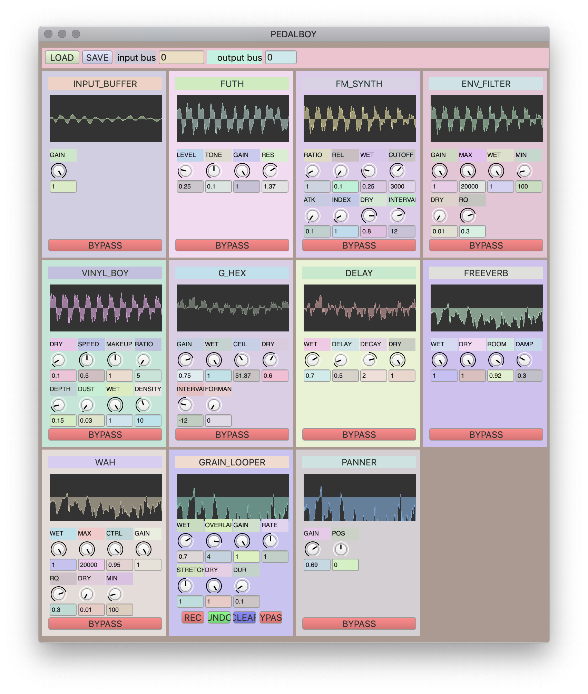

# PedalBoy
A SuperCollider app for real-time effects for ur guitar/voice/etc :)). It uses less latency-expensive algorithms than your typical DAW, so it is meant for live performance.

## Watch the demo
https://youtu.be/YhLWCQQjVYw

## Installation

#### if you've never used SuperCollider before
https://supercollider.github.io/download  
download it from here  
--> know that to "run" SuperCollider code you have to select the text
and then press Shift + Enter to run it.

REMEMBER TO WEAR HEADPHONES IF YOU ARE USING YOUR COMPUTER MIC

put this folder in your extensions directory:

macOS:
`~/Library/Application Support/SuperCollider/Extensions/`

Linux:
`~/.local/share/SuperCollider/Extensions/`

Windows:
`C:\Users\<USERNAME>\AppData\Local\SuperCollider\Extensions`

or run this line on SuperCollider to find out:
`Platform.userExtensionDir`

now, recompile your class library!!!
Cmd+Shift+L or Ctrl+Shift+L

boot the server!!
Cmd+B or Ctrl+B
or run `s.boot`

## Loading the default Pedalboard
create an instance of the default pedalboard:
`p = Pedalboard.default()`

alternatively, run this line in SuperCollider
`p = Pedalboard.load()`

and open `/saved_pedalboards/default.pdlbrd`

## MIDI
Every control is MIDI assignable, so hook it up to ur favorite MIDI thingey.

## SuperCollider ppl:
making your own pedals is super simple! All you need to make is a UGenGraphFunc (what SynthDefs use). GUI and bus routing is taken care of for u.
take a look at example.scd for more guidance.

The Pedalboard helpfile is also pretty helpful. lol

## Donate
hey, I'll take like 5 bucks for coffee :)

